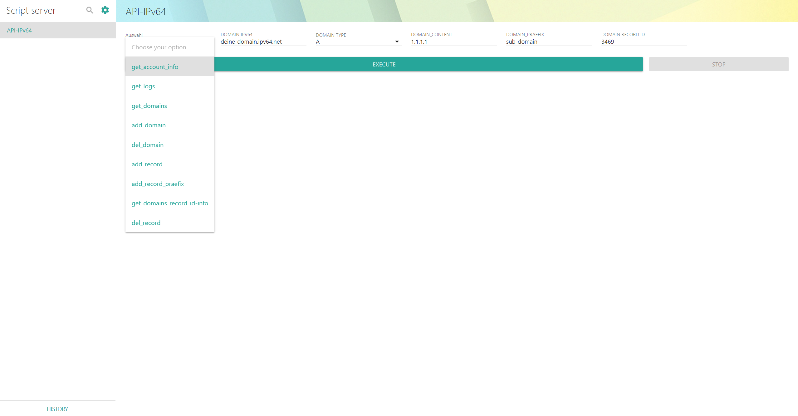

# docker-ddns-ipv64-api-webgui

[](https://drone.docker-for-life.de/alcapone1933/docker-ddns-ipv64-api-webgui)
[](https://drone.docker-for-life.de/alcapone1933/docker-ddns-ipv64-api-webgui/branches)
[](https://hub.docker.com/r/alcapone1933/ddns-ipv64-api-webgui/tags)


API DDNS IPV64.NET Web GUI https://ipv64.net/dyndns_updater_api.php

Danke für die Unterstützung :pray: @[Serpensin](https://github.com/Serpensin) für das python script

***



***

### Docker CLI

```bash
docker run -d \
  -p 5000:5000 \
  -e TZ=Europe/Berlin \
  -e DOMAIN_API=123456787654321234567876543 \
  -e TABELLE_BREITE=40 \
  --name ddns-ipv64-api-webgui \
  --restart=always \
  alcapone1933/ddns-ipv64-api-webgui:latest
```

### Docker Compose

```yaml
version: "3.9"
services:
  app:
    image: alcapone1933/ddns-ipv64-api-webgui:latest
    container_name: ddns-ipv64-api-webgui
    restart: always
    ports:
      - 5000:5000
    environment:
      - TZ=Europe/Berlin
      - DOMAIN_API=123456787654321234567876543
      - TABELLE_BREITE=40
```
## Docs
### [DynDNS API IPV64.NET Vorlage](docs/api-ipv64-net.md)

### [Docker API IPV64.NET Web Gui Vorlage](docs/docker-api-vorlage.md)


## Ports

| Name        | Value   | Example    |
| ----------- | ------- | ---------- |
| Web Port    | 5000    | 5000:5000  |

* * *

## Volume Parameter

| Name (Beschreibung) #Optional  | Wert    | Standard                 |
| -----------------------------  | ------- | ------------------------ |
| Speicherort app                | volume  | data:/app                |
| Speicherort app conf           | volume  | data:/app/conf/conf.json |
| Speicherort app Script Runners | volume  | data:/app/conf/runners   |
| Speicherort app Script         | volume  | data:/app/conf/scripts   |
| Speicherort app logs           | volume  | data:/logs               |

* * *

&nbsp;

## Env Parameter

| Name (Beschreibung)                                                             | Wert           | Standard      | Beispiel                    |
| ------------------------------------------------------------------------------- | -------------- | ------------- | --------------------------- |
| Zeitzone                                                                        | TZ             | Europe/Berlin | Europe/Berlin               |
| DOMAIN API: Dein DOMAIN API zu fiden unter https://ipv64.net/dyndns.php         | DOMAIN_API     | ------------- | 123456787654321234567876543 |
| TABELLE BREITE: Tabellen Breite für die Ausgabe  **get_domains_record_id-info** | TABELLE_BREITE | 40            | 40                          |
