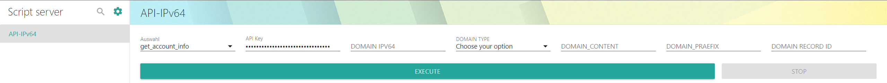
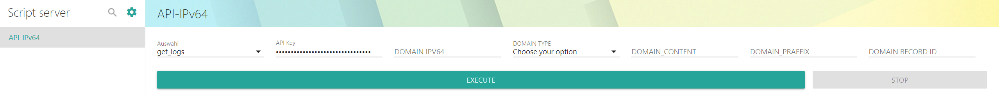
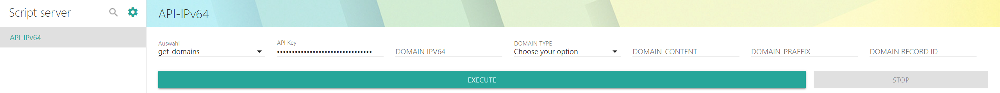
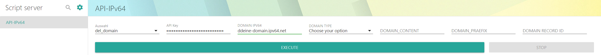
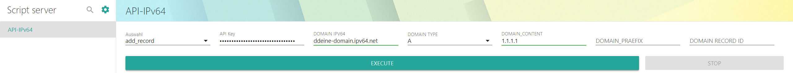
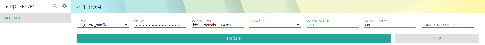
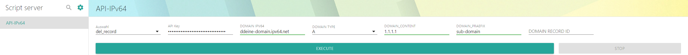

# Docker DDNS IPV64.NET API Web Gui Vorlage


Schau dir Die Volage der API Beispiele [DynDNS API IPV64.NET Vorlage](/docs/api-ipv64-net.md#api-beispiele) um meine Web Gui Vorlage zu verstehen


# Auswahl Api abfrage

## Auswahl Übersicht
- get_account_info = [GET] API Account Informations
- get_logs = [GET] API Account Logging
- get_domains = [GET] API Domain Informations
- add_domain = [POST] API Domain erstellen
- del_domain = [DELETE] API Domain löschen
- add_record = [POST] API DNS Record hinzufügen OHNE PRAEFIX
- add_record_praefix = [POST] API DNS Record hinzufügen MIT PRAEFIX
- get_domains_record_id-info = [GET] API Domain Für Record ID
- del_record = [DELETE] API DNS Record löschen

| Auswahl                       | API Key                     | DOMAIN IPV64            | DOMAIN TYPE | DOMAIN_CONTENT | DOMAIN_PRAEFIX | DOMAIN RECORD ID |
| ----------------------------- | --------------------------- | ----------------------- | ----------- | -------------- | -------------- | ---------------- |
| get_account_info              | 123456787654321234567876543 | ----------------------- | ----------- | -------------- | -------------- | ---------------- |
| get_logs                      | 123456787654321234567876543 | ----------------------- | ----------- | -------------- | -------------- | ---------------- |
| get_domains                   | 123456787654321234567876543 | ----------------------- | ----------- | -------------- | -------------- | ---------------- |
| add_domain                    | 123456787654321234567876543 | ddeine-domain.ipv64.net | ----------- | -------------- | -------------- | ---------------- |
| del_domain                    | 123456787654321234567876543 | ddeine-domain.ipv64.net | ----------- | -------------- | -------------- | ---------------- |
| add_record                    | 123456787654321234567876543 | ddeine-domain.ipv64.net | A           | 1.1.1.1        | -------------- | ---------------- |
| add_record_praefix            | 123456787654321234567876543 | ddeine-domain.ipv64.net | A           | 1.1.1.1        | sub-domain     | ---------------- |
| get_domains_record_id-info    | 123456787654321234567876543 | ----------------------- | ----------- | -------------- | -------------- | ---------------- |
| del_record                    | 123456787654321234567876543 | ----------------------- | ----------- | -------------- | -------------- | 3469             |

***

### Auswahl Api abfrage **get_account_info**
 - get_account_info = [GET] API Account Informations

| Auswahl                       | API Key                     | DOMAIN IPV64            | DOMAIN TYPE | DOMAIN_CONTENT | DOMAIN_PRAEFIX | DOMAIN RECORD ID |
| ----------------------------- | --------------------------- | ----------------------- | ----------- | -------------- | -------------- | ---------------- |
| get_account_info              | 123456787654321234567876543 | ----------------------- | ----------- | -------------- | -------------- | ---------------- |



#### AUSGABE
```json
{
  "email": "dennis@ipv64.net",
  "reg_date": "2022-10-28 16:54:23",
  "update_hash": "1234567890abcdefghijklmn",
  "api_key": "123456787654321234567876543",
  "dyndns_updates": 1,
  "api_updates": 67,
  "account_class": {
    "class_name": "VIP",
    "dyndns_domain_limit": 10,
    "dyndns_update_limit": 512,
    "api_limit": 1024
  },
  "info": "success",
  "status": "200 OK",
  "get_account_info": "get_account_info"
}
```

***

### Auswahl Api abfrage **get_logs**
- get_logs = [GET] API Account Logging

| Auswahl                       | API Key                     | DOMAIN IPV64            | DOMAIN TYPE | DOMAIN_CONTENT | DOMAIN_PRAEFIX | DOMAIN RECORD ID |
| ----------------------------- | --------------------------- | ----------------------- | ----------- | -------------- | -------------- | ---------------- |
| get_logs                      | 123456787654321234567876543 | ----------------------- | ----------- | -------------- | -------------- | ---------------- |




#### AUSGABE
```json
{
  "logs": [
    {
      "subdomain": "",
      "time": "2022-11-17 21:53:19",
      "header": "API: Get Account Info",
      "content": "Alle Accountdaten über API abgefragt."
    },
    {
      "subdomain": "",
      "time": "2022-11-16 08:25:43",
      "header": "API: Get Domains",
      "content": "Anfrage an die API, liefere alle Domaininformationen."
    }
  ],
  "info": "success",
  "status": "200 OK",
  "get_account_info": "get_logs"
}
```

***

### Auswahl Api abfrage **get_domains**
- get_domains = [GET] API Domain Informations

| Auswahl                       | API Key                     | DOMAIN IPV64            | DOMAIN TYPE | DOMAIN_CONTENT | DOMAIN_PRAEFIX | DOMAIN RECORD ID |
| ----------------------------- | --------------------------- | ----------------------- | ----------- | -------------- | -------------- | ---------------- |
| get_domains                   | 123456787654321234567876543 | ----------------------- | ----------- | -------------- | -------------- | ---------------- |



#### AUSGABE
```json
{
  "subdomains": {
    "deine-domain.ipv64.net": {
      "updates": 0,
      "wildcard": 1,
      "records": [
        {
          "record_id": 3469,
          "content": "schroederdennis.de",
          "ttl": 60,
          "type": "CNAME",
          "praefix": "",
          "last_update": "2022-11-02 22:00:00"
        }
      ]
    }
  },
  "info": "success",
  "status": "200 OK",
  "add_domain": "get_domains"
}
```

***

### Auswahl Api abfrage **add_domain**
- add_domain = [POST] API Domain erstellen

| Auswahl                       | API Key                     | DOMAIN IPV64            | DOMAIN TYPE | DOMAIN_CONTENT | DOMAIN_PRAEFIX | DOMAIN RECORD ID |
| ----------------------------- | --------------------------- | ----------------------- | ----------- | -------------- | -------------- | ---------------- |
| add_domain                    | 123456787654321234567876543 | ddeine-domain.ipv64.net | ----------- | -------------- | -------------- | ---------------- |


#### AUSGABE
```json
{
  "info": "success",
  "status": "201 Created",
  "add_domain": "ddeine-domain.ipv64.net"
}
```

***

### Auswahl Api abfrage **del_domain**
- del_domain = [DELETE] API Domain löschen

| Auswahl                       | API Key                     | DOMAIN IPV64            | DOMAIN TYPE | DOMAIN_CONTENT | DOMAIN_PRAEFIX | DOMAIN RECORD ID |
| ----------------------------- | --------------------------- | ----------------------- | ----------- | -------------- | -------------- | ---------------- |
| del_domain                    | 123456787654321234567876543 | ddeine-domain.ipv64.net | ----------- | -------------- | -------------- | ---------------- |



#### AUSGABE
```json
{
  "info": "success",
  "status": "202 Accepted",
  "del_domain": "del_domain"
}
```

***

### Auswahl Api abfrage **add_record**
- add_record = [POST] API DNS Record hinzufügen OHNE PRAEFIX

| Auswahl                       | API Key                     | DOMAIN IPV64            | DOMAIN TYPE | DOMAIN_CONTENT | DOMAIN_PRAEFIX | DOMAIN RECORD ID |
| ----------------------------- | --------------------------- | ----------------------- | ----------- | -------------- | -------------- | ---------------- |
| add_record                    | 123456787654321234567876543 | ddeine-domain.ipv64.net | A           | 1.1.1.1        | -------------- | ---------------- |



#### AUSGABE
```json
{
  "info": "success",
  "status": "201 Created",
  "add_record": "ddeine-domain.ipv64.net"
}
```

***

### Auswahl Api abfrage **add_record_praefix**
- add_record_praefix = [POST] API DNS Record hinzufügen MIT PRAEFIX

| Auswahl                       | API Key                     | DOMAIN IPV64            | DOMAIN TYPE | DOMAIN_CONTENT | DOMAIN_PRAEFIX | DOMAIN RECORD ID |
| ----------------------------- | --------------------------- | ----------------------- | ----------- | -------------- | -------------- | ---------------- |
| add_record_praefix            | 123456787654321234567876543 | ddeine-domain.ipv64.net | A           | 1.1.1.1        | sub-domain     | ---------------- |




#### AUSGABE
```json
{
  "info": "success",
  "status": "201 Created",
  "add_record": "ddeine-domain.ipv64.net"
}
```

***

### Auswahl Api abfrage **get_domains_record_id-info**
- get_domains_record_id-info = [GET] API Domain Für Record ID

| Auswahl                       | API Key                     | DOMAIN IPV64            | DOMAIN TYPE | DOMAIN_CONTENT | DOMAIN_PRAEFIX | DOMAIN RECORD ID |
| ----------------------------- | --------------------------- | ----------------------- | ----------- | -------------- | -------------- | ---------------- |
| get_domains_record_id-info    | 123456787654321234567876543 | ----------------------- | ----------- | -------------- | -------------- | ---------------- |


#### AUSGABE
```json
+----------------------------+-------+------------+--------------------+-----+---------------------+-----------+
|           Domain           |  Type |   Prefix   |      Content       | TTL |     Last Update     | Record ID |
+----------------------------+-------+------------+--------------------+-----+---------------------+-----------+
|  ddeine-domain.ipv64.net   |   A   |            |      1.1.1.1       |  10 | 2022-11-17 22:46:45 |    6754   |
|  ddeine-domain.ipv64.net   |   A   | sub-domain |      1.1.1.1       |  10 | 2022-11-17 22:48:20 |    6755   |
|   deine-domain.ipv64.de    | CNAME |            | schroederdennis.de |  10 | 2022-11-04 07:46:09 |    3961   |
|   deine-domain.ipv64.net   | CNAME |            | schroederdennis.de |  10 | 2022-11-10 23:13:11 |    5805   |
+----------------------------+-------+------------+--------------------+-----+---------------------+-----------+
```

***

### Auswahl Api abfrage**del_record**
- del_record = [DELETE] API DNS Record löschen

| Auswahl                       | API Key                     | DOMAIN IPV64            | DOMAIN TYPE | DOMAIN_CONTENT | DOMAIN_PRAEFIX | DOMAIN RECORD ID |
| ----------------------------- | --------------------------- | ----------------------- | ----------- | -------------- | -------------- | ---------------- |
| del_record                    | 123456787654321234567876543 | ----------------------- | ----------- | -------------- | -------------- | 6754             |



#### AUSGABE
```json
{
  "info": "success",
  "status": "202 Accepted",
  "del_record": "del_record"
}
```